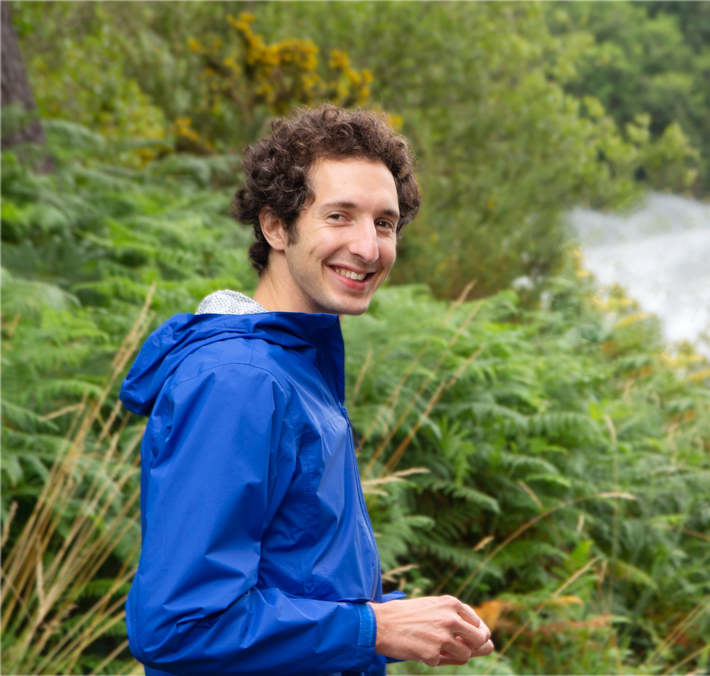

I was introduced to computers at the age of fifteen by playing World of Warcraft, and somehow escalated into using Backtrack to overcome parental WiFi restrictions. I have since continued my education in the field. Today, my interests are more focused on site reliability and some aspects of effective communication. My ideal job would be to solve practical problems for the sake of satisfaction, but the more realistic one is to help businesses making sense of DevOps.

I've been following a nomadic lifestyle for the past three years, living in a different community/city every month or so. I like to spend the rest of my free time hunting for surf spots, writing articles, or reading scientific blogs. I am also a philosopher at heart and genuinely enjoy deep conversations.
